# Midterm

## Introduction / Background
Breast cancer, affecting 1 in 8 women in the United States, is lethal if diagnosed late due to metastasis [1]. Early intervention is vital. Computer-aided detection (CAD) utilizes ML and image processing to provide a second opinion, identifying abnormalities missed by manual review.
#### Literature Review
Traditional diagnosis via fine needle aspiration (FNA) biopsies [2] can often be subject to human variability. Quantitative nuclear features extracted from digital FNA scans enable more efficient differentiation between benign and malignant masses [3]. With more recent advances in Deep Learning and ML algorithms like Support Vector Machines (SVM), machine learning based disease diagnosis (MLBDD) shows accuracies above 90% [4], [5]. 
#### Dataset Description
This project uses the Diagnostic Wisconsin Breast Cancer dataset from the UCI Machine Learning Repository. The dataset contains 569 samples (357 benign and 212 malignant) with 30 numerical features describing cell nucleus characteristics such as radius, texture, concavity, and fractal dimension. The binary target variable indicates whether a tumor is benign or malignant.  
#### Dataset Source
Link: https://archive.ics.uci.edu/dataset/17/breast+cancer+wisconsin+diagnostic

## Problem Definition
### Problem
Diagnostic misclassification is critical. False negatives can delay critical treatment, while false positives cause unnecessary invasive procedures. The lack of transparency in many CAD systems makes it difficult for professionals to trust the automated outputs and black-boxed predictions.
#### Motivation
We aim to maximize recall to ensure no malignancy goes undetected while maintaining high accuracy. Additionally, unsupervised learning will be used to identify latent clusters that may represent different stages of cancer progression.

## Methods
### Data Preprocessing
1. Data Cleaning  
We will drop the non-predictive ID column and programmatically verify the reported lack of missing values.
3. One Hot Encoding  (Implemented in Midterm for SVM)
The Diagnosis column labels (M/B) will be binary encoded as 0 for Benign and 1 for Malignant to facilitate classification.
4. Dimensionality Reduction (Implemented in Midterm for K-means & SVM)   
We will apply Principal Component Analysis to reduce dimensionality of 30 numerical features while preserving maximum variance. PCA will help reduce multicollinearity, improve computational efficiency, and potentially improve generalization.

### Algorithms/Models
1. K-MEANS (Implemented in Midterm)   
K-Means is an unsupervised algorithm that applies hard clustering to separate our data into groupings based on tumor feature similarities. The intent is to roughly align data within clusters with benign and malignant labels.
2. XGBoost  
XGBoost is a supervised prediction algorithm that sequentially learns through gradient boosted decision trees.  XGBoost is not sensitive to linear dependence between features, a beneficial trait given that we begin with 30. We will use the xgboost.XGBClassifier implementation and tune learning rate, max depth, and number of estimators.
3. SVM  (Implemented in Midterm)    
SVM is a supervised algorithm that classifies by maximizing the margin between classes. Particularly powerful for binary classification, it will be applied to predict between benign and malignant tumors. We will experiment with both linear and RBF kernels using sklearn.svm.SVC.


## Results Visualizations & Metrics

### K-Means Clustering

#### Elbow Method
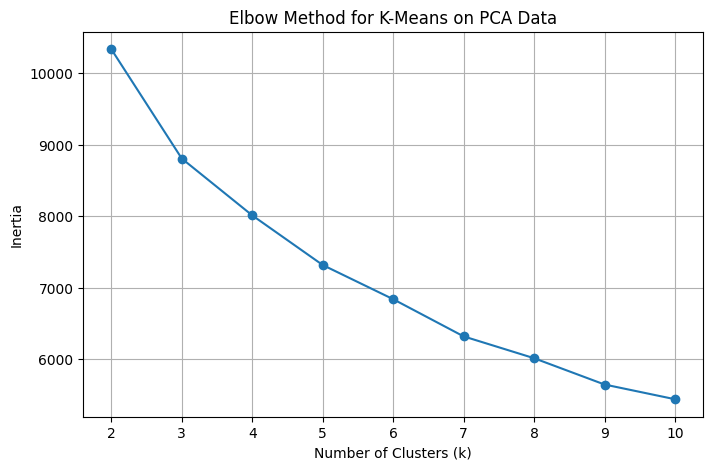

Elbow method showing the within-cluster sum of squares (WCSS) for different cluster counts.

#### Silhouette Scores
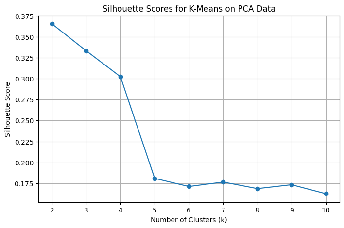

Silhouette scores for each cluster count to confirm the best cohesion and separation.

#### K-Means Clusters on PCA-Reduced Data (2 Clusters)
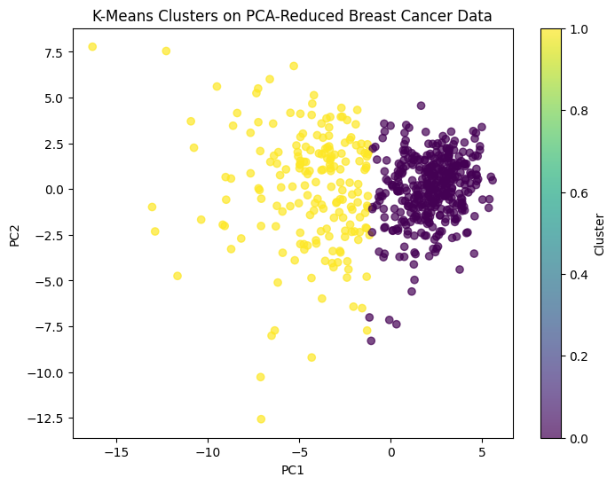

Visualization of the 2 clusters after PCA dimensionality reduction.

#### PCA Projection: Ground Truth vs. K-Means Clusters
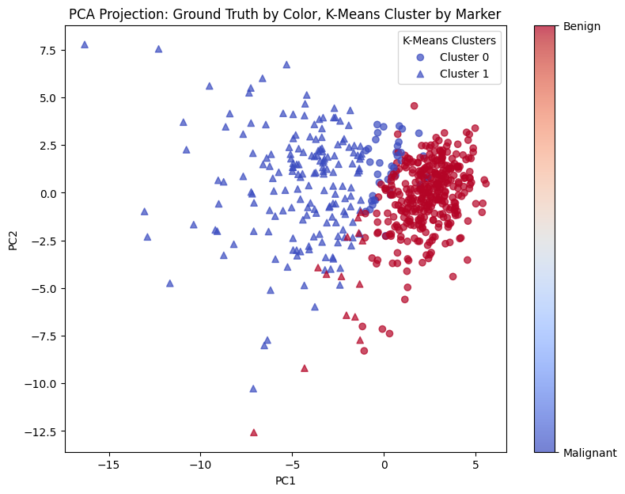

Comparison of true labels (color) with K-Means cluster assignments (marker shape).

### SVM Classification

#### Confusion Matrix
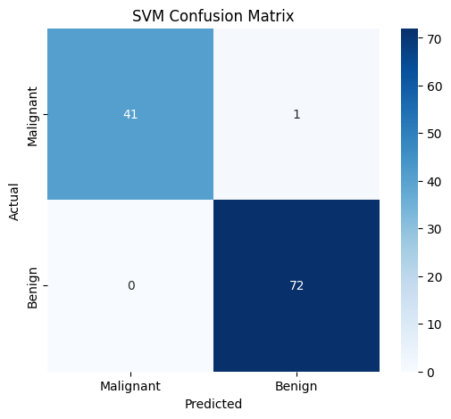

SVM confusion matrix showing true vs. predicted labels.

#### ROC Curve
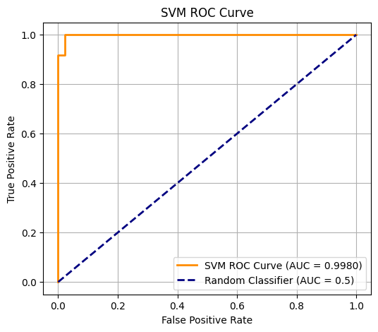

ROC curve and AUC showing the measure of the classifier’s ability to distinguish benign vs. malignant tumors.

#### Learning Curve
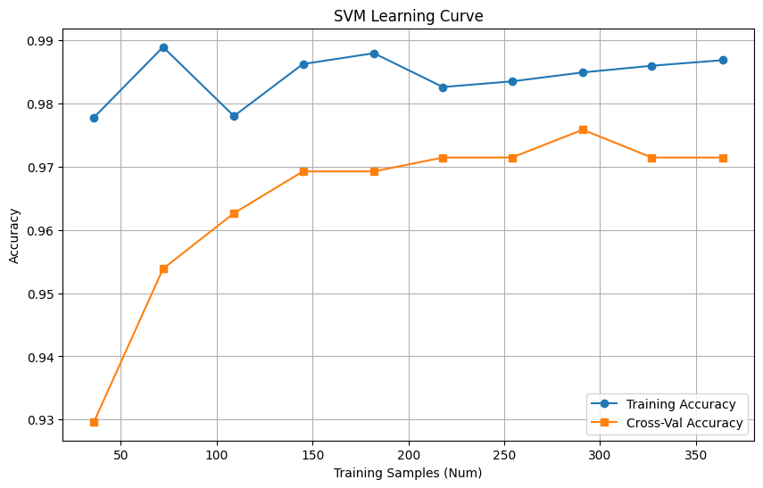

Training and cross-validation accuracy vs. number of training samples.

#### Cross-Validation Accuracy Distribution
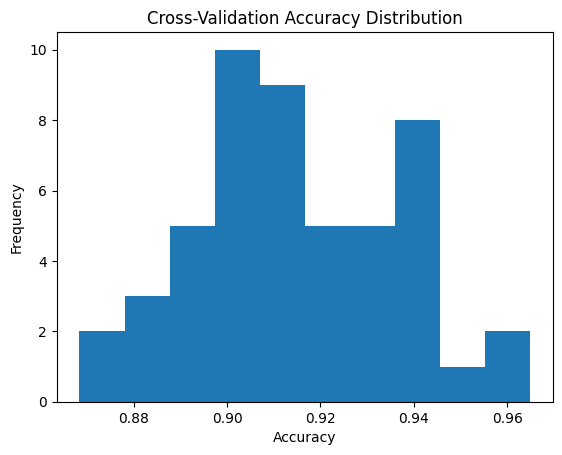

Histogram showing accuracy across 50 repeated stratified CV runs.

#### Stratified K-Fold Accuracy Distribution
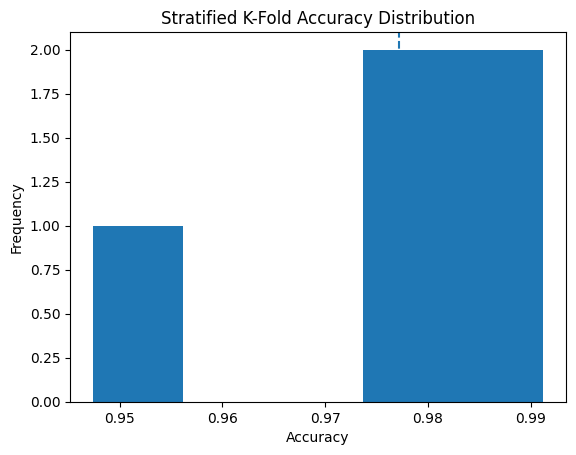

Accuracy distribution from manual 5-fold stratified cross-validation.

#### Feature Reduction Accuracy Comparison
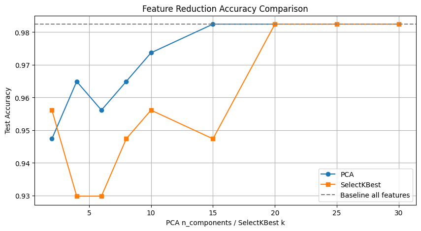  

Test accuracy vs. number of PCA components and SelectKBest features, compared with baseline accuracy.

#### PCA Explained Variance Ratio
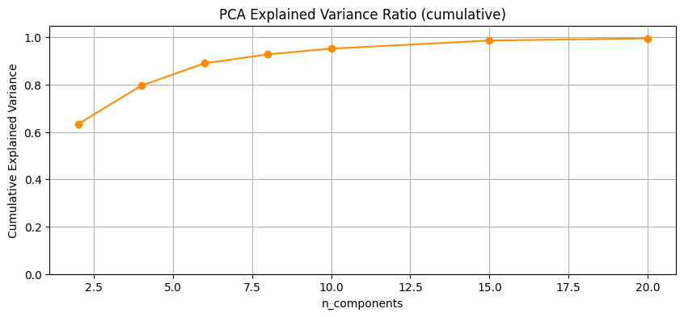  

Cumulative variance captured by PCA components, providing context for feature reduction.

#### Best Accuracy by Reduction Strategy
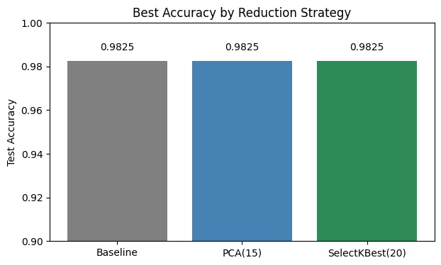  

Bar chart showing baseline, best PCA, and best SelectKBest accuracy.


### Quantitative Metrics

#### K-Means Quantitative Metrics

| k | Inertia   | Silhouette Score | ARI   | NMI   |
|---|-----------|-----------------|-------|-------|
| 2 | 10333.58  | 0.365           | 0.671 | 0.555 |
| 3 | 8804.70   | 0.333           | 0.561 | 0.502 |


#### SVM Quantitative Metrics

| Metric                           | Value   |
|---------------------------------|---------|
| Accuracy                          | 0.9825 |
| Precision (Malignant)             | 0.9861 |
| Recall (Malignant)                | 0.9861 |
| F1 Score (Malignant)              | 0.9861 |
| ROC-AUC                           | 0.9950 |
| CV Mean Accuracy (50 runs)        | 0.9149 |
| CV Std Dev (50 runs)              | 0.0203 |
| Stratified K-Fold Mean Accuracy   | 0.9772 |
| Stratified K-Fold Std Dev         | 0.0163 |


## Results Discussion

### K-Means
The result from the K-means clustering algorithm indicates that the data has some inherent clustering. The verification of this result through the application of the elbow method and silhouette score also indicates that the best number of clusters, k, is 2, which relates to benign and malignant tumors. The inertia of the clusters for k=2 is 10333.58, while the silhouette score is 0.365. The external validation of the clusters also indicates that the best number of clusters, k, is 2, with an ARI of 0.671 and an NMI of 0.555. On the other hand, the result from k=3 indicates a lower inertia of 8804.70, a lower silhouette score of 0.333, an ARI of 0.561, and an NMI of 0.502. The result indicates that, although k=3 captures some other substructure of the data, it does not improve the alignment with the actual benign/malignant classes. The application of the K-means clustering algorithm to the data through the K-means projections onto the PCA indicates that, although the algorithm captures the overall pattern of the data, some overlap exists. The overall result indicates that the K-means clustering algorithm captures the overall pattern of the data, but the data cannot be used to classify tumors for clinical decision-making purposes.

### SVM 
The performance of the SVM classifier showed a high predictive ability with an accuracy of 0.982, precision of 0.986, recall of 0.986, and an F1 score of 0.986. The high ROC-AUC score of 0.995 indicates that it can accurately classify between benign and malignant tumors. The learning curve shows that training accuracy and cross-validation accuracy are converging, which means there is no significant overfitting. The cross-validation accuracy with over 50 runs showed a mean accuracy of 0.915 with a standard deviation of 0.020, whereas the stratified 5-fold cross-validation showed a mean accuracy of 0.977 with a standard deviation of 0.016. This shows that the performance of the SVM model is reliable.

#### Feature Reduction Insights
The feature reduction experiments reveal that the SVM model is able to perform with a near-baseline performance even with fewer features. The results of the PCA algorithm reveal that the maximum accuracy of 0.982 was achieved when the algorithm was executed with 15 components, which represented 98.7% of the variance. The results of the SelectKBest algorithm reveal that the maximum accuracy of 0.982 was achieved when the algorithm was executed with 20 features, which implies that not all of the 30 features are required for the algorithm to perform with a high degree of accuracy. However, the results of the algorithm reveal that with a lower number of features, i.e., 2 or 4, the accuracy of the algorithm is compromised.

### Comparative Analysis
When comparing the two methods, K-Means is a useful exploratory tool for finding latent structure and possible subgroups in the data, but it cannot achieve the predictive accuracy needed for clinical decision support due to its unsupervised nature. On the other hand, SVM offers a robust supervised classification framework with strong generalization and high sensitivity to malignant cases. Supervised models are still necessary for practical clinical predictions, but combining unsupervised insights with supervised classification may enhance interpretability and feature selection.

## Project Goals (Proposal)
Our goal is to compare XGBoost and SVM performance while using K-Means to identify latent feature patterns. We prioritize clinical sustainability through high recall and model transparency. We anticipate accuracies near or above 95%, identifying key morphological predictors like texture and area for clinical decision support.

## Next Steps (post-Midterm)
1. **Implement XGBoost**  
   Develop and tune an XGBoost classifier and compare its performance with SVM using accuracy, recall, and ROC-AUC.

2. **Feature Importance Analysis**  
   Identify the most influential features for tumor classification using SVM coefficients and XGBoost feature importance to enhance interpretability for clinical insights.

3. **Ensemble Methods**  
   Explore combining SVM and XGBoost predictions using ensemble approaches (e.g., voting, stacking) to potentially improve predictive performance and robustness.

4. **Alternative Feature & Dimensionality Reduction**  
   Apply t-SNE or UMAP to visualize tumor features and cluster structures, complementing PCA for exploring the dataset’s latent structure.

5. **Additional Cross-Validation & Hyperparameter Tuning**  
   Conduct more extensive hyperparameter searches and repeated cross-validation for both supervised and unsupervised models to ensure stability and reproducibility.

6. **Integration of Unsupervised Insights**  
   Investigate how K-Means cluster assignments or latent patterns could inform feature selection or model interpretation for supervised classifiers.

## References
[1] L. Shockney, “Breast Cancer Facts & Statistics,” National Breast Cancer Foundation, Jun. 15, 2023. https://www.nationalbreastcancer.org/breast-cancer-facts/

[2] Cleveland Clinic, “Fine-Needle Aspiration,” Cleveland Clinic, May 16, 2023. https://my.clevelandclinic.org/health/diagnostics/17872-fine-needle-aspiration-fna

[3] W. H. Wolberg, W. Nick. Street, D. M. Heisey, and O. L. Mangasarian, “Computer-derived nuclear features distinguish malignant from benign breast cytology,” Human Pathology, vol. 26, no. 7, pp. 792–796, Jul. 1995, doi: https://doi.org/10.1016/0046-8177(95)90229-5.

‌[4] M. M. Ahsan, S. A. Luna, and Z. Siddique, “Machine-Learning-Based Disease Diagnosis: A Comprehensive Review,” Healthcare, vol. 10, no. 3, p. 541, Mar. 2022, doi: https://doi.org/10.3390/healthcare10030541.

[5] M. Golts, “Support Vector Machines,” AI in Asset Management: Tools, Applications, and Frontiers, pp. 40–51, Nov. 2025, doi: https://doi.org/10.56227/25.1.38.

[6] K. T. Chui, M. D. Lytras, and R. W. Liu, “A Generic Design of Driver Drowsiness and Stress Recognition Using MOGA Optimized Deep MKL-SVM,” Sensors, vol. 20, no. 5, p. 1474, Mar. 2020, doi: https://doi.org/10.3390/s20051474.
‌
# Gantt Chart
https://docs.google.com/spreadsheets/d/1q1Ha7X4cs_rv75ANg4HArgvxn4CUn1_MCZZd7z7sMLw/edit?usp=sharing

# Contribution Table
| Name  | Proposal Contributions |
| --- | --- |
| Aesha Shah  | GitHub repo creation & updates, Proposal (Metrics), Slides (Metrics), Video & production, Gantt Chart, SVM code (code modifications & visualizations), Midterm (Next Steps, Directory) |
| Shreema Vijayakumar  | GitHub repo updates, Proposal (Intro, Dataset Analysis, Problem), Slides & Video (Intro, Dataset Analysis, Problem), SVM model code (base code & initial visualizations)|
| Suhaani Gupta  | GitHub repo updates, Proposal (Supervised & Unsupervised Methods), Slides & Video (Supervised & Unsupervised Methods), K-means code (data preprocessing, base code, visualizations) |
| Galadriel Cho  | Proposal (Data Preprocessing & Algorithms/Models), Slides & Video (Data Preprocessing & Algorithms/Models, K-means code (data preprocessing, base code, visualizations) |
| Arya Nalavade  | GitHub repo updates, Proposal (Goals & Expected Results), Slides & Video (Goals & Expected Results), K-means & SVM code (additional quantitative metrics), Midterm (Results & Discussion, Next Steps) |

# GitHub Repository
https://github.gatech.edu/ashah726/ashah726.github.io

## Directory
```
.
├── kmeans/
│   ├── figures/
│   │   ├── kmeans_clusters_2.png
│   │   ├── kmeans_elbow_method.png
│   │   ├── kmeans_silhouette_scores.png
│   │   └── pca_groundtruth_vs_clusters_2.png
│   └── breast_cancer_kmeans.ipynb
├── svm/
│   ├── figures/
│   │   ├── svm_confusion_matrix.png
│   │   ├── svm_cv_accuracy_distribution.png
│   │   ├── svm_learning_curve.png
│   │   ├── svm_roc_curve.png
│   │   ├── svm_skf_accuracy_distribution.png
│   │   ├── svm_feature_reduction_accuracy_comparison.png
│   │   ├── svm_pca_explained_variance_ratio.png
│   │   └── svm_feature_reduction_best_accuracy.png
│   └── breast_cancer_svm.ipynb
├── README.md
└── _config.yaml
```

```
/kmeans/: Contains files related to the K-Means clustering algorithm.
/kmeans/figures/: Visualizations for K-Means analysis:
/kmeans/figures/kmeans_clusters_2.png: Scatter plot of clustered data points (2 clusters).
/kmeans/figures/kmeans_elbow_method.png: Plot showing the optimal number of clusters (K) using the elbow method.
/kmeans/figures/kmeans_silhouette_scores.png: Silhouette scores evaluating cluster consistency.
/kmeans/figures/pca_groundtruth_vs_clusters_2.png: PCA projection comparing true labels vs. K-Means clusters.
/kmeans/breast_cancer_kmeans.ipynb: Jupyter Notebook implementing K-Means on the breast cancer dataset.

/svm/: Contains files related to the Support Vector Machine (SVM) model.
/svm/figures/: Performance plots for the SVM model:
/svm/figures/svm_confusion_matrix.png: Confusion matrix showing classification performance.
/svm/figures/svm_cv_accuracy_distribution.png: Distribution of accuracy across 50 Cross-Validation runs.
/svm/figures/svm_learning_curve.png: Learning curve showing training vs. validation accuracy over sample size.
/svm/figures/svm_roc_curve.png: ROC curve illustrating model sensitivity and specificity.
/svm/figures/svm_skf_accuracy_distribution.png: Accuracy distribution from 5-fold Stratified K-Fold cross-validation.
/svm/figures/svm_feature_reduction_accuracy_comparison.png: Line plot comparing SVM test accuracy across PCA components and SelectKBest features vs. baseline (all features).
/svm/figures/svm_pca_explained_variance_ratio.png: Line plot of cumulative explained variance ratio vs. PCA n_components, showing variance captured by PCA dimensions.
/svm/figures/svm_feature_reduction_best_accuracy.png: Bar plot comparing baseline, best PCA, and best SelectKBest accuracies.
/svm/breast_cancer_svm.ipynb: Jupyter Notebook implementing an SVM model on the breast cancer dataset.

/README.md: Project documentation (proposal & midterm).
/_config.yaml: Configuration file for GitHub Pages site settings and environment configuration.
```

# Proposal Slidedeck & Video 
- https://docs.google.com/presentation/d/1FLcbaeM0SAPhENrqE2YTM4Voni2K-sQHjwmWEPyKncg/edit?usp=sharing
- https://youtu.be/732VsacyU7g

